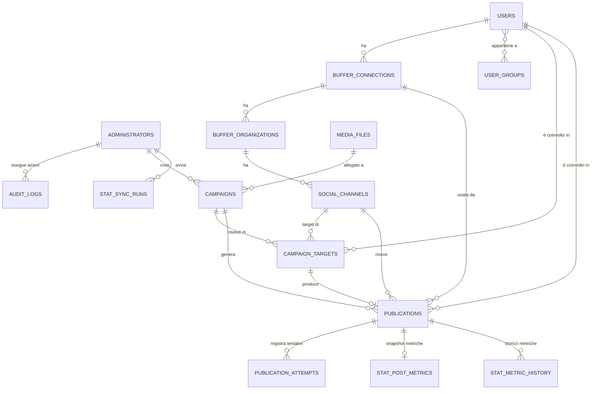

# Schema del database

Spiegazione di tutte le tabelle del progetto, cosa rappresentano e come sono collegate tra loro. Utile per capire il modello dati senza dover leggere il codice, e per chiunque (persona o Claude Code) debba installare o modificare il progetto su un nuovo server. Per il *comportamento* reale del sistema (targeting, stati pubblicazione, task, endpoint) vedi [FUNCTIONALITY.md](./FUNCTIONALITY.md).

Le tabelle sono create dalle migration Alembic in `apps/api/alembic/versions/` (vedi [DEPLOYMENT.md §5](./DEPLOYMENT.md#5-creare-il-database-e-le-tabelle)) a partire dai modelli SQLAlchemy in `apps/api/app/models/`. Questo file descrive lo stato attuale dello schema; se modifichi i modelli, aggiorna anche questo documento (vedi AGENTS.md, regola 20: "Document architectural changes").

Per un dump SQL di sola struttura (nessun dato), pronto da leggere in un unico file senza dover consultare le migration una per una, vedi **[schema.sql](./schema.sql)** — è una fotografia statica generata con `pg_dump --schema-only`, utile come riferimento rapido; le migration Alembic restano comunque l'unica fonte di verità per creare/aggiornare il database (il file stesso lo ricorda in testa).

Le tabelle del modulo Blog Writer AI (`blog_writer_*`) sono documentate separatamente in [BLOG_WRITER.md](./BLOG_WRITER.md#2-schema-database), essendo un modulo isolato con proprio schema.

Le tabelle del modulo Omnichannel Responder (`omni_*`, 15 tabelle) sono documentate separatamente in [OMNICHANNEL_RESPONDER.md](./OMNICHANNEL_RESPONDER.md#3-schema-database) — anch'esso un modulo isolato con proprio schema, collegato al resto della piattaforma solo tramite `owner_id` (FK verso `administrators.id`).

Le tabelle del modulo Statistiche (`stat_*`, 3 tabelle) sono documentate separatamente in [STATISTICS.md](./STATISTICS.md#2-schema-database) — anch'esso isolato, collegato al resto della piattaforma solo tramite foreign key in sola lettura verso `publications`/`campaigns`/`users`/`social_channels`/`buffer_connections`/`administrators`.

---

## Indice

1. [Idea generale](#1-idea-generale)
2. [Diagramma delle relazioni](#2-diagramma-delle-relazioni)
3. [Amministrazione](#3-amministrazione)
4. [Utenti e gruppi](#4-utenti-e-gruppi)
5. [Integrazione Buffer](#5-integrazione-buffer)
6. [Media](#6-media)
7. [Campagne e pubblicazioni](#7-campagne-e-pubblicazioni)
8. [Audit log](#8-audit-log)
9. [Impostazioni AI](#9-impostazioni-ai)
10. [Modulo Statistiche](#10-modulo-statistiche)

---

## 1. Idea generale

Il progetto è una piattaforma multi-tenant per pubblicare contenuti sui social **attraverso Buffer**, non direttamente su Instagram/Facebook/X/ecc. Il flusso concettuale è:

```
Administrator (chi usa la dashboard)
   gestisce →  User (un cliente/amico che ha un proprio account Buffer)
                  ha →  BufferConnection (la sua chiave API Buffer personale)
                          ha →  BufferOrganization (workspace Buffer)
                                  ha →  SocialChannel (un profilo social collegato: la sua pagina FB, il suo IG, ecc.)

Administrator crea → Campaign (testo, media, targeting, quando pubblicare)
   al lancio, per ogni SocialChannel risolto dal targeting →
      CampaignTarget (campagna + canale specifico, testo risolto per quel canale)
         → Publication (lo stato della pubblicazione su quel canale, 1:1 col target)
              → PublicationAttempt (ogni tentativo reale verso l'API di Buffer, per tracciabilità)
```

Principi che guidano lo schema (vedi anche `AGENTS.md` nella root del repo):

- **Ogni canale di destinazione è una pubblicazione indipendente**: una campagna su 5 canali crea 5 `Publication` separate, ognuna con il proprio stato — se 3 riescono e 2 falliscono, non è un fallimento totale.
- **Nessun retry su pubblicazioni già riuscite**: la chiave `idempotency_key` di `Publication` è deterministica (`campaign_id:social_channel_id`), quindi rilanciare la stessa campagna non duplica mai un post già inviato.
- **PostgreSQL è la fonte di verità**: Redis/Celery (i job in background) sono solo il meccanismo di esecuzione, non conservano stato che non sia anche nel database.
- **Ogni richiesta esterna è tracciabile**: ogni chiamata reale all'API di Buffer produce un `PublicationAttempt`, anche se fallisce.
- **I token OAuth/API sono cifrati a riposo**: `access_token_encrypted` e `refresh_token_encrypted` non sono mai testo in chiaro nel database (vedi `EncryptionService`).

---

## 2. Diagramma delle relazioni



Le entità `STAT_*` (modulo Statistiche, vedi [STATISTICS.md](./STATISTICS.md)) sono collegate solo tramite FK in sola lettura verso `PUBLICATIONS`/`CAMPAIGNS`/`USERS`/`SOCIAL_CHANNELS`/`BUFFER_CONNECTIONS` (denormalizzate su `stat_post_metrics` per aggregazioni veloci) — omesse dal diagramma sopra per leggibilità oltre al collegamento con `PUBLICATIONS`, dettagliate in [STATISTICS.md §2](./STATISTICS.md#2-schema-database).

---

## 3. Amministrazione

### `administrators`
Chi ha accesso alla dashboard (voi, non i clienti/amici). Login con email + password.

| Colonna | Tipo | Note |
|---|---|---|
| `id` | UUID (PK) | |
| `email` | string, univoca | |
| `password_hash` | string | hash, mai la password in chiaro |
| `full_name` | string | |
| `is_active` | bool | disattivazione soft senza cancellare l'account |
| `last_login_at` | timestamp | |

---

## 4. Utenti e gruppi

### `users`
Un "utente" qui è un **cliente/amico** della piattaforma — la persona il cui account Buffer viene collegato e sui cui canali si pubblica. Non fa login: è gestito dagli amministratori.

| Colonna | Tipo | Note |
|---|---|---|
| `id` | UUID (PK) | |
| `email` | string, univoca | |
| `status` | string | `active`, `inactive`, `suspended` — solo utenti `active` sono targetabili da una campagna |
| `referral_link` | string, nullable | link personale/da promoter di questo utente, configurabile dalla pagina Utenti (icona 🔗 "Configura referral"). Usato solo se una campagna ha `include_referral_link=true` (vedi §7); un utente senza link configurato non è in nessun modo bloccato, riceve semplicemente il testo campagna invariato |
| `personal_contacts` | string, nullable | blocco di contatti personali/firma di questo utente (nome, telefono, email...), configurabile dalla pagina Utenti (icona 🪪 "Contatti personali"). Usato solo se una campagna ha `include_personal_contacts=true` (vedi §7), aggiunto sempre **subito dopo** l'eventuale `referral_link`; un utente senza contatti configurati non è in nessun modo bloccato, riceve semplicemente il testo campagna invariato |
| `deleted_at` | timestamp, nullable | soft delete: mai cancellazione fisica di un utente con storico |

### `user_groups` / `user_group_association`
Gruppi arbitrari di utenti (es. "Hotel Algarve", "Agenzia Lisbona") per targetizzare le campagne su un sottoinsieme di utenti invece che su tutti. `user_group_association` è la tabella ponte many-to-many tra `users` e `user_groups`.

---

## 5. Integrazione Buffer

Rispecchia il modello dati di Buffer stesso: un account Buffer può avere più workspace ("organizations"), ognuno con più profili social collegati ("channels"). Vedi anche i "problemi noti" in `DEPLOYMENT.md §12` sulla modalità mock vs production.

### `buffer_connections`
Una per utente: la sua **chiave API Buffer personale** (cifrata), non un account a livello di piattaforma. Buffer non offre OAuth di terze parti funzionante (verificato luglio 2026), quindi l'unico meccanismo è l'utente che incolla la propria chiave (Settings → API sul sito Buffer).

| Colonna | Tipo | Note |
|---|---|---|
| `user_id` | UUID (FK → users, CASCADE) | |
| `access_token_encrypted` | string | la chiave API, cifrata a riposo |
| `status` | string | `pending`, `connected`, `expired`, `revoked`, `error`, `disconnected` |
| `external_account_id` | string | ID account restituito da Buffer |

Colonne `refresh_token_encrypted`, `token_expires_at`, `scopes`: esistono ancora (retaggio della vecchia integrazione OAuth) ma restano sempre `NULL` col modello a chiave API personale — vedi [FUNCTIONALITY.md §13](./FUNCTIONALITY.md#13-cose-note-come-non-finite-o-legacy).

### `buffer_organizations`
Workspace Buffer dentro una connessione. Un utente Buffer può averne più di uno.

### `social_channels`
Un **singolo profilo social connesso a Buffer** (una pagina Facebook, un profilo Instagram, un canale YouTube, un account X, ecc.) — questa è l'unità minima con cui Buffer stessa indirizza un post, non un'invenzione di questo progetto.

| Colonna | Tipo | Note |
|---|---|---|
| `platform` | string | `instagram`, `facebook`, `linkedin`, `tiktok`, `youtube`, `x`, `threads`, ... |
| `channel_type` | string, nullable | riportato direttamente da Buffer (`Channel.type`), es. `page`, `group`, `profile`. Un canale Instagram con `channel_type="profile"` è un profilo personale (non Professional/Business) — non può mai pubblicare via API, vedi [FUNCTIONALITY.md §5](./FUNCTIONALITY.md#5-campagne-targeting-e-testo) |
| `external_channel_id` | string | ID canale lato Buffer, usato nelle chiamate `create_post` |
| `external_link` | string, nullable | URL pubblico del profilo/pagina sul social network stesso (`Channel.externalLink` di Buffer — developers.buffer.com/types/Channel.html), non un URL Buffer. `null` se Buffer non lo espone per quella piattaforma. Popolato dal sync (`sync_buffer_connection`) |
| `is_active` | bool | |
| `publication_mode` | string | `automatic`, `notification`, `approval`, `disabled` — solo `disabled` ha un effetto reale (esclude il canale dal targeting, vedi `campaign_resolver.resolve_targets`). `notification`/`approval` sono **puramente descrittivi** oggi: contati a scopo informativo nell'anteprima campagna (`preview_campaign_targets`), ma un canale in questi stati viene comunque pubblicato esattamente come uno `automatic` — nessun flusso di notifica/approvazione separato è implementato |

---

## 6. Media

### `media_files`
File caricati (foto/video) da allegare alle campagne, serviti via Nginx da un volume Docker dedicato (`media_storage`, vedi `DEPLOYMENT.md §12` punto 5 — non è nel dump del database, va copiato a parte).

| Colonna | Tipo | Note |
|---|---|---|
| `public_url` | string | URL pubblico HTTPS — Buffer scarica il media da qui, deve essere raggiungibile da internet |
| `mime_type`, `size_bytes` | | limite upload configurabile via `UPLOAD_MAX_SIZE_BYTES` (100MB di default) |
| `duration_seconds`, `width`, `height`, `video_codec`, `audio_codec` | | metriche estratte via ffprobe, solo per i video |
| `processing_status` | string | `uploaded`, `inspecting`, `processing`, `ready`, `failed` |
| `metadata_json` (colonna `metadata`) | JSONB | include `thumbnail_path`/`thumbnail_url` generati via ffmpeg — usati solo per l'anteprima interna, **non** inviati a Buffer (l'API reale rifiuta thumbnail personalizzate per i video, vedi commento in `prod_client.py`) |

---

## 7. Campagne e pubblicazioni

### `campaigns`
Una campagna di pubblicazione: testo, media opzionale, quando/come pubblicare, e su quali canali (targeting).

| Colonna | Tipo | Note |
|---|---|---|
| `default_text` | string | testo di default, sovrascrivibile per piattaforma |
| `media_file_id` | UUID (FK → media_files, SET NULL), nullable | foto/video allegato alla campagna, vedi [§6](#6-media) |
| `article_id` | UUID (FK → blog_writer_articles, SET NULL), nullable | valorizzata solo se la campagna nasce da "Usa per campagna social" nel modulo Blog Writer — puramente informativa, nessun comportamento di pubblicazione dipende da questo campo. Vedi [BLOG_WRITER.md](./BLOG_WRITER.md#campaignsarticle_id) |
| `instagram_text`, `facebook_text`, `linkedin_text`, `tiktok_text`, `x_text`, `threads_text` | string, nullable | override di testo per piattaforma specifica |
| `youtube_title`, `youtube_description` | string, nullable | YouTube richiede un titolo strutturato separato dal testo/descrizione (vedi `campaign_resolver.py`) |
| `publishing_mode` | string | `immediate`, `scheduled`, `buffer_queue`, `draft`, `approval` |
| `scheduled_at` / `timezone` | timestamp UTC / string | l'orario è sempre salvato in UTC; `timezone` conserva il fuso orario scelto dall'utente per mostrarlo correttamente in dashboard (le date lato utente devono preservare il fuso selezionato, vedi `AGENTS.md`) |
| `targeting_mode` | string | `all_active_channels`, `selected_users`, `selected_groups`, `selected_channels`, `selected_platforms` |
| `include_referral_link` | bool, default `false` | se `true`, `resolve_text_for_channel` (`campaign_resolver.py`) aggiunge in fondo al testo risolto per ogni canale il `referral_link` dell'utente **proprietario di quel canale specifico** (mai di un altro utente — la risoluzione avviene per canale, ognuno carica solo il proprio `BufferConnection.user`). Un utente senza `referral_link` configurato non viene escluso né genera errore: il testo resta invariato per lui, esattamente come con questa opzione spenta. Il testo con link incluso passa comunque per lo stesso controllo `PLATFORM_TEXT_LIMITS` di sempre (es. 280 caratteri per X/Twitter): un link che fa sforare il limite fa fallire solo quel target, non l'intera campagna |
| `include_personal_contacts` | bool, default `false` | stessa meccanica di `include_referral_link` sopra, ma per il `personal_contacts` dell'utente proprietario del canale, aggiunto **subito dopo** l'eventuale link referral (mai prima, mai su un canale di un altro utente). Un utente senza `personal_contacts` configurato non viene escluso né genera errore. Stesso controllo `PLATFORM_TEXT_LIMITS` del link referral: un blocco contatti che fa sforare il limite fa fallire solo quel target |
| `metadata_json` (colonna `metadata`) | JSONB | parametri di targeting effettivi (es. `channel_ids`), salvati per permettere a `poll_and_queue_scheduled_publications` di rilanciare una campagna programmata con la stessa selezione |
| `status` | string | `draft`, `preparing`, `queued`, `running`, `paused`, `partially_completed`, `completed`, `failed`, `cancelled` |

### `campaign_targets`
Una riga per ogni coppia `(campagna, canale)` risolta al momento del lancio — con vincolo di unicità (`uq_campaign_target_campaign_channel`) che impedisce duplicati se si rilancia la stessa campagna.

| Colonna | Tipo | Note |
|---|---|---|
| `resolved_text` | string | testo finale calcolato per quel canale specifico (override canale → testo piattaforma → testo di default) |
| `status` | string | `pending`, `created`, `failed` |

### `publications`
Lo stato reale della pubblicazione su Buffer per un target — relazione 1:1 con `campaign_targets`. Qui vive la macchina a stati e l'idempotenza.

| Colonna | Tipo | Note |
|---|---|---|
| `idempotency_key` | string, univoca | deterministica: `"{campaign_id}:{social_channel_id}"` — impedisce di ripubblicare due volte lo stesso target |
| `status` | string | `pending`, `queued`, `processing`, `submitted`, `scheduled`, `published`, `retry_wait`, `failed`, `cancelled`, `skipped`, `unknown` |
| `attempt_count` / `max_attempts` | int | numero tentativi effettuati / limite (default `MAX_PUBLICATION_ATTEMPTS`) |
| `external_post_id`, `external_post_url` | string, nullable | riferimento al post reale creato su Buffer |
| `error_category`, `error_code`, `error_message` | string, nullable | ultimo errore, se presente |

### `publication_attempts`
Un record per **ogni** chiamata reale all'API di Buffer relativa a una `Publication` — anche quelle fallite. È il meccanismo di tracciabilità richiesto da `AGENTS.md` ("ogni richiesta esterna deve essere tracciabile a un Publication Attempt").

| Colonna | Tipo | Note |
|---|---|---|
| `attempt_number` | int | |
| `success` | bool | |
| `http_status`, `external_error_code`, `error_category`, `error_message` | | dettaglio dell'errore Buffer, se fallito |
| `sanitized_request`, `sanitized_response` | JSONB | payload scambiati con Buffer, ripuliti da credenziali — **mai** salvare qui token o Authorization header (vedi `AGENTS.md`) |
| `duration_ms` | int | |

---

## 8. Audit log

### `audit_logs`
Log di sicurezza/tracciabilità delle azioni amministrative (es. `campaign_launch`, `user_deactivate`, `login`). Non viene mai cancellato dalle normali operazioni di pulizia dati — resta come storico anche se la campagna o l'entità a cui si riferisce viene rimossa (`entity_id` non ha vincolo di foreign key, apposta, per sopravvivere alla cancellazione dell'entità).

| Colonna | Tipo | Note |
|---|---|---|
| `administrator_id` | UUID (FK → administrators, SET NULL) | chi ha eseguito l'azione |
| `action` | string | es. `campaign_launch` |
| `entity_type` / `entity_id` | string / UUID | a cosa si riferisce l'azione |
| `metadata_json` (colonna `metadata`) | JSONB | dettagli extra (es. numero di canali targetizzati) |
| `ip_address`, `user_agent` | string, nullable | |

---

## 9. Impostazioni AI

### `ai_settings`
Riga singola (singleton: zero o una riga, mai più di una) con la chiave API OpenAI **personale dell'amministratore**, configurabile dalla pagina Impostazioni della dashboard (non dal `.env` — vedi [FUNCTIONALITY.md §5](./FUNCTIONALITY.md#5-campagne-targeting-e-testo) e [DEPLOYMENT.md](./DEPLOYMENT.md)). Alimenta il pulsante "Genera con AI" nella creazione campagna.

| Colonna | Tipo | Note |
|---|---|---|
| `openai_api_key_encrypted` | string, nullable | cifrata a riposo con lo stesso `EncryptionService` (Fernet) usato per le chiavi Buffer — mai testo in chiaro nel database, mai restituita dall'API (`GET /settings/ai` risponde solo `configured: bool`) |
| `openai_model` | string | default `gpt-4o-mini`, modificabile dalla stessa schermata |
| `updated_at` | timestamp | |

Se questa riga non esiste o non ha una chiave impostata, il backend ricade sulla variabile d'ambiente `OPENAI_API_KEY` (se presente) solo come default di primo avvio — la riga in questa tabella, quando presente, ha sempre la precedenza.

---

## 10. Modulo Statistiche

Schema completo, motore di sync e endpoint documentati separatamente in **[STATISTICS.md](./STATISTICS.md)** — modulo isolato, 3 tabelle (`stat_sync_runs`, `stat_post_metrics`, `stat_metric_history`), collegato al resto della piattaforma solo tramite foreign key in sola lettura verso `publications`/`campaigns`/`users`/`social_channels`/`buffer_connections`/`administrators`. Persiste (invece di ricalcolare ogni volta) le metriche Buffer per post, navigabili in dashboard per utente → canale → campagna.
